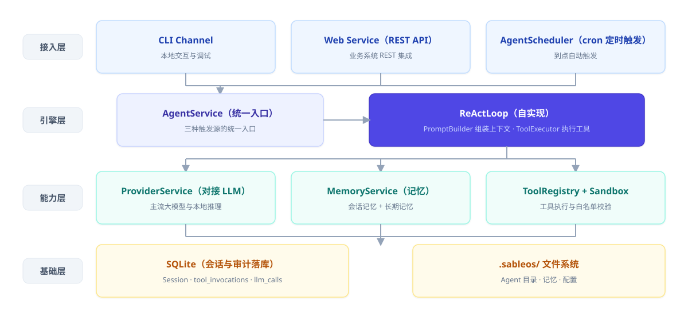

<!-- markdownlint-disable MD033 MD041 -->

<p align="center">
  
</p>

<!-- markdownlint-enable MD033 MD041 -->

# SableOS


> 一个目录定义一个 Agent，一个底座运行一群 Agent。

**项目状态：文档先行。** 仓库当前包含设计文档（`docs/`）与 Maven 多模块骨架（9 个模块，`mvn clean package` 可通过），业务代码尚未开始编写；技术方案已定稿，实现节奏见[路线图](#路线图)。

## 什么是 SableOS

SableOS 是一个**企业能完全掌控的、Java 原生的、私有可审计的 Agent OS（Agent Harness OS）**。它装在企业自己的 K8s、服务器或物理机上，作为统一底座运行各类业务 Agent——运维助手、客服助手、HR 助手、销售助手、知识管理助手——它们共享一套渠道接入、模型路由、记忆系统、工具调用与安全审计能力。业务方不写 Agent 后端代码，只需配置 Agent、编写 Tool；数据完全留在企业自己的基础设施，不锁任何云生态。

Agent harness（运行骨架）是套在模型外面、把模型变成能干活的 Agent 的那层脚手架：驱动 reason → act → observe 循环，提供工具与执行机制，组装每次调用前的上下文，积累记忆，约束沙箱，记录审计——裸模型只会生成文本，harness 才让它可靠、安全地"做事"。

SableOS 的北极星公式：

> 自然语言(md) + Memory + Tool + MCP(Connector) + Skill + 知识库 + Notify = 一个 Agent

在生态分层里，SableOS 守住"运行时"这一层：框架（如 Spring AI、LangChain4j）给你代码、要你自己搭运行环境；编排平台（如 Dify、Coze）给你流程、跑在运行时之上；SableOS 给的是运行时本身——一个让 Agent 能常驻、可治理、可审计地跑起来的底座，并原生对接 MCP、A2A 等开放协议。项目的长期目标是走进 Apache 基金会，成为 Apache 顶级项目。

## 为什么需要 SableOS

企业把 Agent 用起来，大多卡在四道门槛上：

- 定义一个 Agent 要写代码，最懂业务的人反而做不了
- 云平台要把数据拿走，合规过不去
- 执行是黑盒——没有审计、没有白名单、没有审批，企业不敢上生产
- 跑一个容易、跑一群难，缺一层管理"一群 Agent 的操作系统"

SableOS 一次拆掉这四道门槛：自然语言定义、私有部署、全链路审计加沙箱、为一整队 Agent 准备的生命周期与治理。更深一层的判断是：**让 Agent 在生产环境可靠工作，瓶颈通常不在模型本身，而在 Agent 的运行环境**——上下文是否正确、工具是否受控、调用是否可隔离可审计，这些都不是"模型更强"能解决的。

而业界已验证的两个开源 Agent OS——Node.js 的 OpenClaw（偏个人与小团队）、Python 的 Hermes Agent（偏工程健壮）——都不是 Java。Java 恰恰是大量企业后端的事实标准：Spring Boot 与 Nacos、Sentinel、SkyWalking、Prometheus 等运维体系可以直接复用；Tool 能直接调企业现有 Java 服务，不用写跨语言胶水；严监管行业的私有部署与合规审计也能走现有流程。SableOS 把已被验证的设计哲学（目录形态的 Agent 定义、MCP 工具、单二进制部署）在 Java 生态重新实现，补上"Agent OS"这一层的缺位：让 Java 生态的企业装一个 Agent 底座，像装一个 Spring Boot 应用一样自然。

## 核心特性

- **一个目录 = 一个 Agent**：一个包含 `AGENT.md` 的目录定义一个 Agent，不用写代码，多个 Agent 在同一实例并存
- **Java 原生**：基于 JDK 21 与 Spring Boot 3.x，单可执行 JAR 部署，复用企业现有的 Java 运维工具链
- **私有可控**：装在企业自己的 K8s、虚拟机或物理机上，数据不出域，不锁任何云
- **安全隔离**：工具调用经文件、命令、网络白名单校验，强制沙箱隔离，凭证走企业密钥体系不落地，全链路可审计——安全从第一天就在架构里
- **自实现 ReAct**：核心推理循环自己实现，不套外部 Agent 框架，机制完全可控
- **对接开放标准**：工具用 MCP、Agent 协作用 A2A、Agent 目录借 Anthropic Agent Skills 的形态，与生态协同而不另立协议
- **三档工具扩展**：零代码 Agent 目录加复用 MCP、轻代码自写 MCP server、重代码原生 Java 方法，按门槛自由选择
- **跨对话记忆**：会话加长期两层记忆，长期记忆后端可插拔（Markdown / SQLite / Mem0），让 Agent 记得住偏好与关键事实
- **无状态可扩展**：运行实例无状态、状态外置，从架构起为分布式演进留好路

## 架构

技术栈一句话：**JDK 21 + Spring Boot 3.x + Spring AI Alibaba + 自实现 ReAct loop + SQLite + Picocli**。一次消息的处理链路分四层：



五个核心能力构成运行时内核：

| 核心能力 | 说明 |
| --- | --- |
| 对接 LLM | Provider 抽象统一对接主流大模型与本地推理（Ollama、vLLM 等）；多 Provider 通过显式映射并存，运行时切换无锁定 |
| ReAct 循环 | 自实现的推理引擎：LLM 决定调不调工具、调哪个，执行后回填结果继续推理，直到给出最终响应或达到最大迭代次数（默认 10） |
| Memory 记忆 | 统一门面提供会话记忆与长期记忆；长期记忆默认落 `.sableos/memory/MEMORY.md`，后端可插拔（Markdown / SQLite / 自托管 Mem0） |
| Tool 体系 | 九个内置 Tool（文件、Shell、HTTP、记忆、通知五组）加 Plugin Tool 三档接入；MCP Client 对接外部工具；文件、Shell、HTTP 与通知类调用经 `Sandbox` 白名单校验，全部调用落 `tool_invocations` 审计 |
| Web Service | 所有能力经 REST API 对外暴露，核心阶段 10 个端点；业务系统用任何语言经 HTTP 接入 |

> 引擎与能力之间、能力与外部之间都通过抽象接口解耦：扩展阶段加新 Channel、新 Provider、新 Tool 只需在边缘扩展，不动核心引擎。

### 工程结构

Maven 多模块项目，共 14 个模块（以[《技术方案》第 10 章](docs/TechnicalSolution.md)为准）：

| 模块 | 职责 |
| --- | --- |
| `sableos-core` | 核心抽象与接口：`SableTool`、`Profile`、`ContextLoader`、`ReActLoop`、`PromptBuilder`、`ToolExecutor`、`AgentService`、`AgentScheduler` 等 |
| `sableos-persona` | 人格库：内置人格预设加 `.sableos/personas/` 自定义人格 CRUD |
| `sableos-provider` | 核心能力一：Provider 服务、Function Calling 适配、provider name 到 `ChatModel` 的显式映射 |
| `sableos-memory` | 核心能力三：记忆统一门面、长期记忆、`save_memory` / `recall_memory` 工具 |
| `sableos-knowledge` | 知识库：解析 / 切分 / 向量化流水线，双路召回加 RRF 融合检索 |
| `sableos-tool` | 核心能力四：内置 Tool、MCP Client、`ToolRegistry`、`Sandbox` 与通知适配器（三合一模块） |
| `sableos-channel-cli` | CLI Channel：`sableos chat` 交互对话 |
| `sableos-channel-feishu` | 飞书入站渠道：长连接收事件、出站过沙箱、自动重连 |
| `sableos-channel-wecom` | 企微入站渠道（对称飞书） |
| `sableos-channel-dingtalk` | 钉钉入站渠道（对称飞书 / 企微） |
| `sableos-web` | 核心能力五：Web Server、六个 ApiController、OpenAPI 文档 |
| `sableos-storage` | 持久化层：Session、Tool 调用与 LLM 调用审计落库 |
| `sableos-cli` | 命令行入口：Picocli、`ConfigLoader` |
| `sableos-boot` | Spring Boot 启动模块：主类、自动配置、依赖聚合 |

模块之间通过接口解耦：扩展阶段加新 Channel 或新 Tool 实现只加新模块，不改 core。

## 快速开始

> 当前仓库处于文档先行阶段，以下命令以[《技术方案》](docs/TechnicalSolution.md)为准，核心阶段实现后可用。骨架阶段即已可验证：`mvn clean package` 后运行 `java -jar sableos-cli/target/sableos-cli-0.1.0-SNAPSHOT-all.jar`，会打印 SableOS 版本信息。

环境要求：

- JDK 21 或更高（Spring Boot 3.x 要求）
- Maven
- 一个 LLM Provider：云端 API，或本地 Ollama / vLLM 等 OpenAI 兼容服务
- 生产部署面向 Linux 主流发行版（Ubuntu 22.04+、CentOS 8+、Debian 11+ 等）

```bash
# 1. 构建：产出可执行 fat JAR
mvn clean package

# 2. 初始化工作区：创建 .sableos/ 目录结构
sableos init

# 3. 生成一个 Agent 目录（.sableos/agents/weather-bot/AGENT.md）
sableos profile create weather-bot

# 4. 交互对话
sableos chat

# 5. 启动 Web Service：REST API 与 Swagger UI，默认端口 8080
sableos serve
```

一个最小 `AGENT.md` 长这样：frontmatter 是这个 Agent 的运行配置（派生成 `Profile`），正文写任务指令。

```yaml
name: weather-bot
description: 每天早上播报天气并给出穿搭建议

identity:
  agent_name: 天气助手
  prompt: 你是天气播报助手，关注用户所在城市的天气变化

provider:
  name: deepseek
  model: deepseek-chat
  temperature: 0.7

tools:
  - http_get
  - notify

settings:
  max_iterations: 10
  max_history_turns: 20
```

Skill 绑定通过 Agent 目录下 `skills/` 的相对软连接表达，不写进 frontmatter；内容每次现读、不缓存，修改后下一轮立即生效。定义方式的完整说明见[《技术方案》第 11 章](docs/TechnicalSolution.md)。

三种运行模式：

| 命令 | 模式 | 说明 |
| --- | --- | --- |
| `sableos chat` | 交互对话 | 本地 CLI 交互 |
| `sableos serve` | Web Service | 启动 REST API 服务，定时任务随之常驻调度 |
| `sableos gateway` | 守护进程 | 同时挂载多个渠道 |

## 文档

| 文档 | 内容 |
| --- | --- |
| [docs/IndustryResearch.md](docs/IndustryResearch.md) | Agent OS 行业格局、Java 生态缺位与 SableOS 定位 |
| [docs/DemandAnalysis.md](docs/DemandAnalysis.md) | 需求、数据模型、里程碑与验收标准 |
| [docs/TechnicalSolution.md](docs/TechnicalSolution.md) | 架构、模块与接口，编码时的权威依据 |
| [docs/AiProgrammingGuide.md](docs/AiProgrammingGuide.md) | Spec-Kit 开发流程与 AI coding 协作方式 |
| [docs/sableos.md](docs/sableos.md) | 项目对外简介 |
| [docs/sable-labs.md](docs/sable-labs.md) | 社区背景 |

> 文档之间若出现修订不同步，以[《技术方案》](docs/TechnicalSolution.md)为准。

## 生态与标准

- [Model Context Protocol（MCP）](https://modelcontextprotocol.io/)：LLM 与外部工具、数据源连接的开放协议，工具生态的事实标准
- [Agent Skills](https://agentskills.io/)：Skill 的开放目录格式，SableOS 的 Agent 目录借其形态
- [Spring AI](https://spring.io/projects/spring-ai) / [Spring AI Alibaba](https://java2ai.com/)：LLM Provider 抽象与主流模型 connector，SableOS 的底层 LLM 调用层
- A2A（Agent2Agent）：面向 Agent 互操作的开放协议，用于跨节点 Agent 协作（路线图阶段三）

## 路线图

- **阶段一（当前）单机运行时内核**：五大核心能力跑通——配置即 Agent、多 Agent 并存、REST API 接入、对接 MCP，把单节点运行和管理一群 Agent 做到可用
- **阶段二（规划）底座分布式**：节点无状态化、状态外置、多副本部署，支撑更大规模与高可用
- **阶段三（愿景）跨节点 Agent 协作**：引入 Agent 通信底座、对接 A2A，让多节点上的 Agent 跨节点发现、委托、可靠异步协同
- **横向能力（伴随各阶段逐步补齐）**：多租户、SSO、完整审计查询、Tool 治理、可观测与 Web 管理台

## 设计原则

- **底座优先于 Agent**：最重要的交付不是某个强大的 Agent，而是让任意 Agent 都能可靠运行的环境
- **配置即 Agent**：一个 Agent 由一份配置定义，而不是由代码写出
- **自实现核心，可控优先**：核心推理循环自己实现，底层模型协议适配复用成熟库，不重复造轮子
- **对接开放标准**：工具用 MCP、协作用 A2A、技能用开放格式，与生态协同
- **无状态实例，状态外置**：从单机平滑走向分布式的前提
- **安全是地基不是补丁**：工具来源受控、最小权限、强制沙箱、凭证不落地、全链路可审计
- **分阶段克制**：当前只做运行时内核的最小完备集，每次架构升级都用真实使用数据证明其必要性

## 参与贡献

SableOS 由 [sable-labs](docs/sable-labs.md) 社区发起——一个 AI coding 驱动的 AI 探索社区：用 AI 写代码、做设计、推进工程，把想法变成能跑的东西并开源出来。欢迎围绕 Agent 方向发起或加入项目。

当前仓库处于文档先行阶段，欢迎通过 Issue / PR 参与讨论与共建：

- 对设计文档提出问题与修正；文档之间出现修订不同步时，以[《技术方案》](docs/TechnicalSolution.md)为准
- 开发流程按 Spec-Kit 驱动（准备阶段产出宪章、spec、plan，按 user story 实施，每个 user story 结束后做一致性检查），见[《AI 编程指南》](docs/AiProgrammingGuide.md)
- 在本仓库工作的 AI coding agent 请先阅读 [CLAUDE.md](CLAUDE.md)

## 许可证

[Apache License 2.0](https://www.apache.org/licenses/LICENSE-2.0)。
